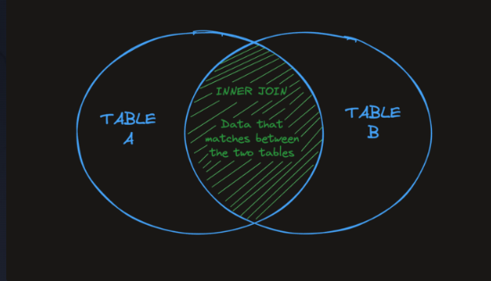
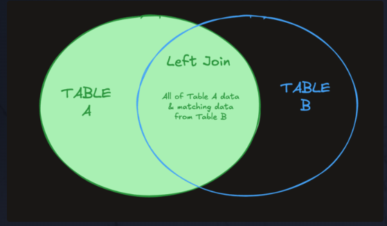

# Joins
Joins are one of the most important features that SQL offers. Joins allow us to make use of the relationships we have set up between our tables. In short, joins allow us to query multiple tables at the same time.

# Inner Join
The simplest and most common type of join in SQL is the INNER JOIN. By default, a JOIN command is an INNER JOIN. An INNER JOIN returns all of the records in table_a that have matching records in table_b as demonstrated by the following Venn diagram.



# On
To perform a table join, we need to tell the database how to "match up" the rows from each table. The ON clause specifies the columns from each table that should be compared.

When the same column name exists in both tables, we have to specify which table each column comes from using the table name (or an alias) followed by a dot . before the column name.
```
SELECT *
FROM employees
INNER JOIN departments
ON employees.department_id = departments.id;
```

In this query:

employees.department_id refers to the department_id column from the employees table.
departments.id refers to the id column from the departments table.
The ON clause ensures that rows are matched based on these columns, creating a relationship between the two tables.

The query above returns all the fields from both tables. The INNER keyword only affects the number of rows returned, not the number of columns. The INNER JOIN filters rows based on matching department_id and id, while the SELECT * ensures all columns from both tables are included.

# Left Join
A LEFT JOIN will return every record from table_a regardless of whether or not any of those records have a match in table_b. A left join will also return any matching records from table_b. Here is a Venn diagram to help visualize the effect of a LEFT JOIN.



A small trick you can do to make writing the SQL query easier is define an alias for each table. Here's an example:

SELECT e.name, d.name
FROM employees e
LEFT JOIN departments d
ON e.department_id = d.id;

Notice the simple alias declarations e and d for employees and departments respectively.

Some developers do this to make their queries less verbose. That said, I personally hate it because single-letter variables are harder to grok.

# Right Join
A RIGHT JOIN is, as you may expect, the opposite of a LEFT JOIN. It returns all records from table_b regardless of matches, and all matching records between the two tables.

# Full Join
A FULL JOIN combines the result set of the LEFT JOIN and RIGHT JOIN commands. It returns all records from both from table_a and table_b regardless of whether or not they have matches.

# Multiple Joins
To incorporate data from more than two tables, you can utilize multiple joins to execute more complex queries!

```
SELECT *
FROM employees
LEFT JOIN departments
ON employees.department_id = departments.id
INNER JOIN regions
ON departments.region_id = regions.id;
```